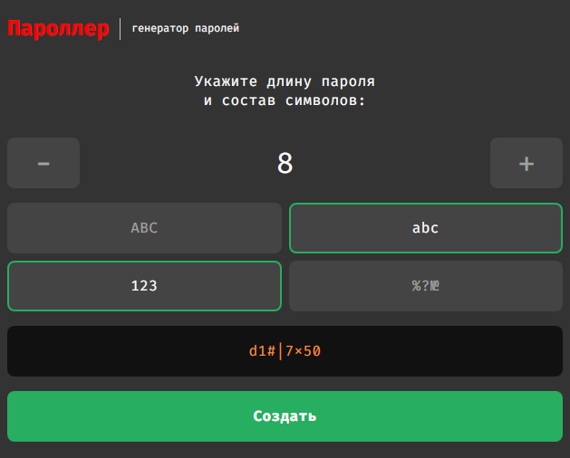

# Пароллер

Позволяет сгенерировать пароль по нескольким опциям:
- количество символов;
- прописные, строчные буквы;
- специальные символы.

[Демо](https://mchlv.ru/paroller)



Параметры конфигурации находятся в ```app.js```:
- минимальная/максимальная длина пароля, длина по-умолчанию:
```javascript
    const config = {
        start: 3,
        end: 20,
        current: 8
    };
```
- выбранные опции по-умолчанию:
```javascript
    const options = {
        uppercase: false,
        lowercase: true,
        numbers: true,
        symbols: false
    };
```

- наборы символов:
```javascript
    const strings = {
        uppercase: "ABCDEFGHIGKLMNOPQRSTUVWXYZ",
        lowercase: "abcdefghijklmnopqrstuvwxyz",
        numbers: "1234567890",
        symbols: `!"#$%&'()*+,-./:;<=>?@[\]^_{|}`
    };
```
